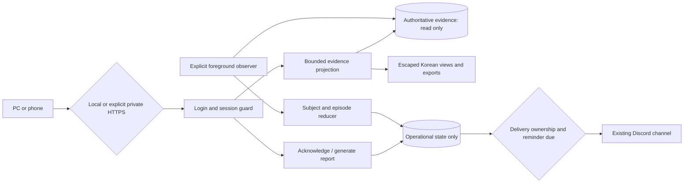

# Phase 14: Operator Web UI, Dashboard & Alerting - Research

**Researched:** 2026-10-01
**Domain:** Authenticated Korean evidence dashboard and operational alert monitoring
**Confidence:** MEDIUM (official documentation cross-check confidence returned by GSD seam)

<user_constraints>
## User Constraints (from CONTEXT.md)

The following decision block is copied verbatim. [VERIFIED: 14-CONTEXT.md]

<!-- DATA_7cf29a81_START -->
## Implementation Decisions

### First screen and navigation
- **D-01:** The landing screen prioritizes operational safety: unresolved orders, active safety blocks, worker health and source observation times, followed by account and holdings summaries. Coverage still includes every required Phase 14 view.
- **D-02:** Mobile presents the safety summary first, with holdings, orders and run details available through separate detail screens. Preserve the same evidence and supported non-trading actions rather than dropping mobile capabilities.
- **D-03:** Desktop uses a left navigation grouped as operational overview / account and holdings / decisions and orders / validation and reports. Mobile uses a collapsible navigation. Worker health, candidates, fills, run history, replay, soak, calibration and readiness must be discoverable within those groups.
- **D-04:** Follow the device/system light or dark preference automatically. The user chose this instead of the recommended light-only default. Keep tables/numbers readable and communicate severity through text and icons as well as color.

### Access and login
- **D-05:** Default access is from the execution PC through local binding. Support explicitly configured private VPN access from the owner's phone outside the home, including mobile data. Do not expose the app publicly by default. VPN access does not replace application authentication. The user asked what private networking meant and then chose outside-home phone access after the VPN explanation; no VPN vendor was selected.
- **D-06:** Use one dedicated operator account and password, provisioned during initial setup. These credentials are separate from KIS and LLM credentials. No public signup or external-account login is required.
- **D-07:** Login lasts at most 12 hours, after which authentication is required again. Treat this as an absolute session lifetime rather than an indefinitely sliding expiry.
- **D-08:** Permit concurrent PC and phone sessions, with independent session expiry. Logging in on the phone does not log the PC out.

### Refresh and evidence review
- **D-09:** Refresh saved evidence automatically every 30 seconds and provide a manual refresh button. Display the source's actual observation time separately from the browser refresh time. Refresh does not refresh KIS truth or execute an LLM.
- **D-10:** Retain the last successfully observed value when data becomes stale or a query fails; visibly label staleness, failure and observation time. Unknown totals stay UNKNOWN, never zero or inferred complete. A saved complete observation can still be old; do not present it as current account truth.
- **D-11:** Drill down from a total/status to its constituent rows, then an individual record with decision reasons, order progression and source IDs, then expandable source evidence. Every displayed aggregate must have attributable durable details. Source evidence means a sanitized, authorized projection; it does not permit exposing secrets, raw exception bodies or arbitrary stored payloads.
- **D-12:** Default run/decision/order history to today in Asia/Seoul, with operator-selectable periods. Unresolved orders and active alerts remain visible across dates. Do not hide the existing unresolved 000660 subject through today's date filter or treat disappearance as resolution.

### Alerts and report workflows
- **D-13:** Show all alert severities and history in the web app. Use the existing Discord notification channel for WARNING/CRITICAL events and recovery notifications. INFO remains available in the web view; retain existing production notifications without creating duplicate deliveries.
- **D-14:** Group repeated observations of the same underlying problem into one incident. Notify on occurrence, worsening and recovery. Remind every 30 minutes for an unacknowledged CRITICAL incident; WARNING has no periodic reminder. Durable occurrence counts, duration and delivery-attempt history remain reviewable across refreshes/restarts. A newly worsened or recurring incident must not inherit acknowledgement of an earlier state.
- **D-15:** Acknowledgement means the operator has read the alert. Record operator identity and time automatically; a response note is optional. Acknowledgement stops that incident's periodic reminders but does not resolve it, clear a freeze/latch, alter broker evidence or relax any safety gate. Active warnings remain visible until source evidence establishes recovery.
- **D-16:** Provide Korean TXT reports, structured JSON results and CSV tables suitable for spreadsheet review. Preserve source IDs, report scope, denominators and UNKNOWN/INCOMPLETE facts in exports; identify simulated/advisory results. Generate/export existing read-only reports from saved evidence. Exporting a report never starts replay/backtest/shadow evaluation or live data collection.

### Required implementation boundaries and agent discretion

All selected areas are resolved; the user did not delegate preference questions to the agent. Frameworks, module names, internal schemas, precise layouts, secure session storage, password hashing/recovery, bounded queries, pagination, accessible components and implementation mechanics remain research/planning decisions.

- Enforce authentication and authorization throughout pages, evidence endpoints, report generation/download and acknowledgement. State-changing requests must be CSRF-protected and audit logged. Password/session material and secret-bearing configuration are never displayed or exported.
- Read production evidence through capability-limited readers. Do not instantiate credential-bearing trading Settings, broker/LLM collaborators, mutation leases or live CLI orchestration inside the web runtime. Store session, acknowledgement, web-action audit and alert delivery bookkeeping separately from authoritative trading evidence; web writes cannot amend source facts or migrate production databases.
- Preserve separate mock/real/dry-run/simulated/shadow scopes, broker versus local observation provenance, report denominators and advisory readiness semantics. Validate supported schemas and source links. Missing sources or inconsistent cross-store links remain unavailable/UNKNOWN, with per-source observation facts rather than a claimed atomic cross-database snapshot.
- Worker health derives from durable lifecycle/heartbeat evidence and the applicable session/expected-worker state. Distinguish stopped/not expected from stale/failed and UNKNOWN when expectation cannot be established. No record does not prove health. Research/planning chooses documented thresholds compatible with existing watch cadence and manual operation; Phase 15 scheduling is not a prerequisite for displaying current evidence.
- Alerts cover failed/stale workers and cycles, unresolved orders, safety latches and broker divergence. Deduplication uses stable account/target/problem subjects and incident transitions, not page refreshes or iteration UUIDs. Use existing INFO/WARNING/CRITICAL semantics where supported; detection/display never acquires order authority or invents broker recovery.
- Alert observation and reminders must work independently of an open browser while their explicitly started, non-trading monitoring process is running. Define its local start/stop/health contract and durable delivery accounting. This permits bounded operational monitoring, not unattended trading scheduling. Notification transport failures remain visible and do not rewrite trading outcomes. Preserve existing mandatory transition-evidence safety behavior.
- CSV content must be safe to open in spreadsheet software; render all third-party news, LLM reasons, stored text and operator notes as untrusted content. Allow only registered evidence/report resources and bounded sanitized exports, not arbitrary local paths or executable commands.
- VPN deployment details and the concrete authentication/web stack need current primary-source research during planning. No installation, public deployment, notification sending or trade is authorized by this discussion alone.

<!-- DATA_7cf29a81_END -->

### Deferred Ideas (OUT OF SCOPE)

<!-- DATA_4a8d13be_START -->
## Deferred Ideas

None introduced by the user; the discussion stayed within Phase 14. Existing roadmap boundaries retain unattended trading scheduling and pause/resume/kill control in Phase 15, controlled real-money pilot authorization in Phase 16, and all manual evidence/promotion gates. No PDF export or external-account login was selected.

<!-- DATA_4a8d13be_END -->
</user_constraints>

## Summary

Use a synchronous Flask application factory, Jinja templates, native CSS/JavaScript, Flask-WTF CSRF protection and Waitress. This fits the existing synchronous SQLite/report projections and avoids a separate frontend build/runtime. Flask documents factories, a pytest test client, and production Waitress deployment; its async views do not provide durable background tasks. [CITED: https://flask.palletsprojects.com/en/stable/patterns/appfactories/] [CITED: https://flask.palletsprojects.com/en/stable/testing/] [CITED: https://flask.palletsprojects.com/en/stable/deploying/waitress/] [CITED: https://flask.palletsprojects.com/en/stable/async-await/]

Build new bounded readers and presentation DTOs, an independent operational database, and an explicitly started foreground non-trading alert observer. Existing reports are reusable after import-capability separation; they are insufficient for whole-account/detail coverage. Keep trading evidence read-only and preserve the unresolved 000660 freeze. [VERIFIED: reporting.py; portfolio_store.py; STATE.md; 14-CONTEXT.md]

**Primary recommendation:** Plan capability isolation and evidence attribution before UI routes; then implement authentication, complete views/exports, durable incidents/observer, and negative-capability validation. [VERIFIED: 14-CONTEXT.md; planning recommendation]

<phase_requirements>
## Phase Requirements

| ID | Description | Research Support |
|---|---|---|
| FUT-03 | Authenticated responsive validation, portfolio, order, soak, calibration, readiness and health review | Read-only evidence catalog and Korean views. [VERIFIED: REQUIREMENTS.md] |
| UI-01 | All required desktop/mobile views with durable drill-down | New account/detail readers, source envelopes and navigation contract. [VERIFIED: REQUIREMENTS.md] |
| UI-02 | Authenticated non-trading actions; no order/LLM/policy/secrets/promotion/gate authority | Separate entry points/settings/database plus import and route tripwires. [VERIFIED: REQUIREMENTS.md] |
| OPSV-01 | Deduplicated severity alerts for workers/cycles/orders/latches/divergence | Subject/episode reducer, owned deliveries and independent observer. [VERIFIED: REQUIREMENTS.md] |
</phase_requirements>

## Project Constraints (from AGENTS.md)

Python, Korea-only sources, strict three-field signals, mock-first operation, BUY confidence >=0.8 and fail-safe parsing remain constraints. Use typed configuration and gitignored secrets; regard news as untrusted. Existing patterns govern implementation. Work must remain within GSD workflow; this research belongs to the authorized phase-planning workflow. No production edits, installs, broker/LLM calls, notifications or deployment were performed. [VERIFIED: AGENTS.md; assigned research scope]

AGENTS.md's inherited stack guidance prefers python-kis, ta, SDK structured outputs, pydantic-settings, SQLite, Typer, structured logging, bounded retries and isolated news parsing; prohibits mojito2, default native TA-Lib, assistant-prefill JSON forcing, hardcoded secrets and scattered untyped environment reads. Phase 14 adds no broker/provider adapter. Actual shipped PROJECT.md records direct KIS REST; preserve it rather than changing trading architecture to reconcile old stack prose. [VERIFIED: AGENTS.md; PROJECT.md]

## Architectural Responsibility Map

| Capability | Primary Tier | Secondary Tier | Rationale |
|---|---|---|---|
| Login/session/CSRF/resource authorization | Web backend | Operational SQLite | Server enforces authorization and absolute expiry. [CITED: https://cheatsheetseries.owasp.org/cheatsheets/Session_Management_Cheat_Sheet.html] |
| Evidence projections/reports | Read-only backend | Existing evidence owners | Sources remain authoritative and independent. [VERIFIED: soak_reporting.py] |
| Navigation/theme/30s refresh | Browser | Web backend | Refresh reads saved evidence only. [VERIFIED: 14-CONTEXT.md] |
| Incidents/reminders/delivery | Foreground observer | Operational SQLite/Discord | Browser-independent, no trading scheduling. [VERIFIED: 14-CONTEXT.md] |

## Standard Stack

All new package names below were confirmed through official documentation and PyPI metadata, not registry existence alone. Versions/dates were read on 2026-10-01. Package legitimacy returned SUS; do not tag them VERIFIED registry approvals. [VERIFIED: PyPI JSON; GSD package-legitimacy output]

| Library | Version / release date | Purpose |
|---|---|---|
| flask [WARNING: flagged as suspicious — verify before using.] | 3.1.3 / 2026-02-19 | Synchronous routes/factory. [CITED: https://flask.palletsprojects.com/en/stable/changes/] |
| flask-wtf [WARNING: flagged as suspicious — verify before using.] | 1.3.0 / 2026-04-23 | CSRFProtect for forms/AJAX. [CITED: https://flask-wtf.readthedocs.io/en/latest/csrf/] |
| waitress [WARNING: flagged as suspicious — verify before using.] | 3.0.2 / 2024-11-16 | Production WSGI serving. [CITED: https://docs.pylonsproject.org/projects/waitress/en/latest/] |
| werkzeug [WARNING: flagged as suspicious — verify before using.] | 3.1.9 / 2026-09-27 | Flask dependency; supported password hashing. [CITED: https://werkzeug.palletsprojects.com/en/stable/utils/] |
| jinja2 [WARNING: flagged as suspicious — verify before using.] | 3.1.6 / 2025-03-05 | Escaped templates. [CITED: https://jinja.palletsprojects.com/en/stable/api/] |
| playwright / pytest-playwright [WARNING: flagged as suspicious — verify before using.] | 1.63.0 / 2026-09-15; 0.9.0 / 2026-08-10 | Browser test extra. [CITED: https://playwright.dev/python/docs/test-runners] |

Retain installed pytest 8.4.2, httpx 0.28.1, Pydantic 2.13.4 and pydantic-settings 2.11.0; SQLite/csv/secrets are stdlib. Recommend a web dependency extra and browser test extra; no installation during research. [VERIFIED: pyproject.toml; local package inspection]

### Alternatives Considered

Django supplies integrated authentication and is strongest when admin/users/ORM migrations are central; those add little to this single-operator, external-evidence reader. FastAPI supports synchronous handlers, but this phase needs neither an async service nor a separate SPA. Flask-Login manages login state but does not remove the need for server-side absolute expiry/revocation; omit it initially. These are architectural recommendations, not claims that alternatives are unsuitable generally. [CITED: https://docs.djangoproject.com/en/5.2/topics/auth/default/] [CITED: https://fastapi.tiangolo.com/async/] [CITED: https://flask-login.readthedocs.io/en/latest/]

## Package Legitimacy Audit

The seam flagged every proposed package SUS, chiefly because weeklyDownloads is null. It also missed source links stored as Source Code/homepage for some PyPI projects; official metadata independently supplied those links. Werkzeug/Playwright additionally received latest-release age warnings. These observations establish classifier limitations, not evidence of compromise. [VERIFIED: GSD package-legitimacy output; PyPI JSON]

| Packages | Registry | Source repository | Verdict / disposition |
|---|---|---|---|
| flask / werkzeug / jinja2 | PyPI | pallets/flask, pallets/werkzeug, pallets/jinja | SUS / retain warning. [VERIFIED: PyPI JSON] |
| flask-wtf | PyPI | pallets-eco/flask-wtf | SUS / retain warning. [VERIFIED: PyPI JSON] |
| waitress | PyPI | Pylons/waitress | SUS / retain warning. [VERIFIED: PyPI JSON] |
| playwright / pytest-playwright | PyPI | microsoft/playwright-python, microsoft/playwright-pytest | SUS / browser extra warning. [VERIFIED: PyPI JSON] |

Package age/download totals were not established; null is unavailable. No SLOP packages were found. The explicit researcher Package Legitimacy Gate requires checkpoint:human-verify before installing SUS packages; retain that precise installation checkpoint, without treating it as a general stop on planning or imposing speculative approvals. [VERIFIED: assigned package-legitimacy protocol; seam output]

## Architecture Patterns



This is a proposed data-flow architecture grounded in the locked capability boundaries. [VERIFIED: 14-CONTEXT.md; planning recommendation]

### Existing API and evidence owners

| Owner/API | Reuse and necessary extension |
|---|---|
| reporting.ReadOnlyAuditRepository.load_daily(date), load_period(start,end); build_daily_report/build_period_report/render_* | Existing run/candidate DTOs preserve completeness and denominators; add bounded detail/pagination rather than making large load_period calls on each refresh. [VERIFIED: reporting.py] |
| portfolio_store schema v3, portfolio_schema_metadata owner phase11 | Co-located with primary audit schema v3 but independently versioned; new read-only portfolio reader must validate both capability sets without migrate/connect mutators. [VERIFIED: portfolio_store.py; sqlite_audit.py] |
| portfolio_snapshots/holdings/orders/fills/divergences | Full-account normalized evidence; no target column. Resolve target through attributable run links or explicit trusted resource scope; hash alone must not be relabeled mock/real by inference. [VERIFIED: portfolio_store.py] |
| daily_evaluations/events; watch_iterations/observations; mutation_leases/events | Decision provenance/reasons and worker facts; never expose canonical prompt bytes or lease owner_token. watch_iterations.cycle_id equals iteration ID whereas snapshots use outer watch cycle; join via snapshot_id. [VERIFIED: portfolio_store.py; cli.py] |
| ReadOnlySoakRepository(audit,soak,controller).load(campaign); build_soak_report | Independently validated stores and source-link checks. Extend attributable freeze/comparison/detail projections; never claim cross-store atomicity. [VERIFIED: soak_reporting.py] |
| ReadOnlyCalibrationEvidenceRepository(audit,soak).load(campaign); build_calibration_report; build_readiness_assessment | Advisory builders; existing calibration portfolio projection uses campaign PRE_RUN touched evidence, not whole-account Phase 11 truth. Readiness manual booleans cannot become web approval controls. [VERIFIED: calibration_reporting.py; promotion_readiness.py] |
| load_replay_results/build_replay_report; load_backtest_result/render_backtest_report; load_shadow_result/render_shadow_report | Saved-result validation only. Register IDs/paths outside requests; retain simulated/advisory labels, coverage, cost/usage denominators and hashes. [VERIFIED: reporting.py; backtest_reporting.py; shadow_reporting.py] |

### Capability and import isolation

Separate bot-web and bot-alerts entry points from trading_bot.cli. WebSettings owns only explicit resource paths, binding/authentication settings and operational storage. Observer settings alone may own Discord credentials. Neither imports/constructs full Settings, runtime factories, broker/provider collaborators or mutation leases. [VERIFIED: 14-CONTEXT.md; cli.py; notifier.py]

Existing imports are coupled: reporting imports replay (execution/MockBroker); backtest_reporting imports BacktestRun from backtest_engine (execution); shadow_reporting._checked_result imports ShadowExecution from shadow_runner (provider factory/journal). notifier imports Settings. Extract shared DTOs/canonical helpers/schema constants/offline validation into capability-free modules while preserving existing exports, JSON identity and checks. Simply not calling a dangerous imported factory is insufficient for the intended process boundary. [VERIFIED: reporting.py; replay.py; backtest_reporting.py; backtest_engine.py; shadow_reporting.py; shadow_runner.py; notifier.py; planning recommendation]

### Freshness and disclosure

Incomplete portfolio collection persists safe_cash/safe_total=0 placeholders. Therefore completeness gates numeric availability: unknown is null/UNKNOWN, never a zero balance. Retain the last valid complete snapshot as historical evidence, alongside current failed/incomplete attempt, source time, query time and stale/error state. Each aggregate/detail binds one snapshot/resource ID; do not mix newest holdings with older cash. Missing marks mean unrealized totals are unavailable. [VERIFIED: portfolio.py:475; portfolio_store.py; 14-CONTEXT.md]

Use allowlisted DTO fields, bounded plain text and registered source IDs. sanitize_detail rejects forbidden key shapes but is not content secret detection; shadow observations explicitly retain raw_output and embedded documents. Never serialize dataclasses/models wholesale, expose raw exception text, prompt/config blobs, absolute paths or arbitrary JSON. Unknown/inconsistent links remain visible. [VERIFIED: audit_models.py; shadow_models.py; 14-CONTEXT.md]

### Sessions, CSRF and private access

Provision one operator through local setup/reset command with hidden password input; reset revokes all sessions. Use Werkzeug scrypt hashing with explicit reviewed parameters, not raw SHA password hashes. OWASP recommends scrypt N=2^17,r=8,p=1 when Argon2id is unavailable; assess memory/cost in implementation rather than silently adopting Werkzeug's lower default. [CITED: https://werkzeug.palletsprojects.com/en/stable/utils/] [CITED: https://cheatsheetseries.owasp.org/cheatsheets/Password_Storage_Cheat_Sheet.html]

Use supported signed Flask session only for an opaque session reference/CSRF material. Authoritative operational session rows bind operator, issuance, absolute issuance+12h expiry and revocation; two clients have separate rows. Validate every request server-side; polling never extends expiry. CSRFProtect covers login/logout, acknowledgement and report generation, including X-CSRFToken on AJAX. [CITED: https://flask.palletsprojects.com/en/stable/config/] [CITED: https://flask-wtf.readthedocs.io/en/latest/csrf/] [VERIFIED: 14-CONTEXT.md; planning recommendation]

Loopback is default. Private remote mode requires explicit allowed origin/host and HTTPS behind a trusted private endpoint; trust proxy headers only from configured proxy. Set HttpOnly/SameSite cookies, Secure in HTTPS mode, no-store evidence responses and CSP. Do not activate debug or public listeners. Tailscale Serve documents one private HTTPS example, not a selected vendor or authorized deployment. [CITED: https://flask.palletsprojects.com/en/stable/security/] [CITED: https://tailscale.com/kb/1312/serve] [VERIFIED: 14-CONTEXT.md]

### Durable incident and observer contract

Use subject=(resource/account,target,ticker-or-account,problem family,broker subject where relevant), episode and severity revision. Persist source cursor/IDs, occurrence count/duration, acknowledgement operator/time/note and delivery attempts in operational SQLite. Idempotent processing counts new source observations, not browser polls. Worsening/recurrence creates an unacknowledged revision/episode. [VERIFIED: 14-CONTEXT.md; planning recommendation]

canonical_transition_identity includes normalized state; record_transition_state returns no notification for an already historical identity. Reusing its identity as permanent incident ID would inherit acknowledgement and suppress recurrence. Consume ordered transition observations into the separate episode reducer; do not rewrite Phase 11 state. [VERIFIED: audit_models.py; portfolio_store.py]

Phase 11 retains ownership of its occurrence/change/recovery notifications; import/link their durable attempts without sending them again. Observer owns new derived incidents and CRITICAL reminders. Define event ownership explicitly, including what happens when a transition exists but notification evidence does not: UNKNOWN must not be mistaken for definitely unsent. Claims/outbox must commit before network dispatch; crash after send but before receipt remains delivery UNKNOWN, with no exactly-once claim. Preserve TransitionEvidenceGuard's fail-closed trading evidence contract. [VERIFIED: intraday.py; portfolio_store.py; 14-CONTEXT.md; planning recommendation]

Propose alerts watch/once/status foreground commands, 30s polling and stop-flag shutdown. This is operational monitoring only. Persist start/heartbeat/stop, exclusive observer ownership, scan cursor and next reminder time. On restart reconstruct active episodes and bounded overdue reminders; no burst catch-up. Acknowledgement stops 30min CRITICAL reminders only; recovery requires positive same-subject durable facts, never disappearance or acknowledgement. No WARNING reminders. [VERIFIED: 14-CONTEXT.md; planning recommendation]

Worker health must not assume a scheduler. STARTED/STOPPED, released/lost lease and watch terminal observations provide expectation/failure facts. assert_active_owner leaves heartbeat unchanged and current watch has no renew call; the configured 30s lease heartbeat is not observed liveness. Propose stale threshold max(180s,3*documented cadence) for an established running watch; otherwise UNKNOWN. This threshold is a planner-selected operational default, not a trading gate or verified production heartbeat promise. Use observed iteration freshness and separate lease age; never renew/reclaim from web. [VERIFIED: mutation_lease.py; intraday.py; cli.py; config.py; planning recommendation]

## Proposed File Map / Component Responsibilities

The following map is proposed for pattern mapping/planning, not existing APIs. [VERIFIED: source modules above; planning recommendation]

| Files | Responsibility / closest pattern |
|---|---|
| trading_bot/evidence_contracts.py, replay_evidence.py, backtest_evidence.py, shadow_evidence.py | Pure contracts/helpers/validators extracted from coupled report/execution modules; preserve compatibility exports. |
| trading_bot/web_config.py, web_cli.py, web_app.py | Independent typed config, setup/serve and factory; ReportSettings/report_cli are patterns only. |
| trading_bot/web_evidence.py, web_models.py | ReadOnlyPortfolioRepository/detail readers, source catalog and freshness envelopes; reporting/soak_reporting patterns. |
| trading_bot/web_auth.py, web_store.py | Session validation, auth/action audit, CSRF integration; independently versioned operational DB. |
| trading_bot/web_reports.py | Validated saved report service and TXT/JSON/CSV presentation; no report CLI invocation. |
| trading_bot/alert_models.py, alert_store.py, alert_observer.py, alert_cli.py | Subject episodes, owned outbox, foreground observation/reminders and health. |
| trading_bot/notification_transport.py | Credential-independent bounded Discord transport extraction; notifier compatibility retained. |
| trading_bot/templates/operator/*, static/operator.css, static/operator.js | Korean responsive views, system theme, 30s/manual refresh and detail navigation. |
| pyproject.toml; docs/operator-runbook.md | Extras/entry points/package data and setup/private access/observer operations. |

Define reader protocols before routes: source_status(), overview(scope), list_records(scope,period,cursor,limit), get_record(resource_id,record_id), generate_report(registered_request). Return DTOs with schema/source identity, scope, source observation time, completeness, rows and attributable counts. Read methods cannot supply mutable connections. Operational write API exposes sessions, action audit, acknowledgement and delivery bookkeeping only. [VERIFIED: 14-CONTEXT.md; planning recommendation]

## Don't Hand-Roll

| Problem | Use instead |
|---|---|
| Password hash / CSRF / HTML encoding | Werkzeug, Flask-WTF, Jinja autoescape. [CITED: documentation URLs above] |
| Existing metrics, readiness and saved integrity | Existing validated pure builders, preserving checks during extraction. [VERIFIED: reporting modules] |
| Whole-account truth from touched campaign rows | Phase 11 snapshot reader. [VERIFIED: portfolio_store.py; calibration_reporting.py] |
| Arbitrary download filesystem | Registered resources and generated bounded in-memory attachments. [CITED: https://werkzeug.palletsprojects.com/en/stable/utils/] |

## Common Pitfalls

Missing evidence must not produce healthy, zero, PASS or recovered. Today's KST history must not filter all-date unresolved orders/active incidents. SOURCE COMPLETE and CURRENT FRESH are separate facts. Mixed target/account IDs must fail attribution. Queries require bounds, pagination and parameterized identifiers/values; never request-driven table names. [VERIFIED: 14-CONTEXT.md; repository schemas; planning recommendation]

CSV quoting alone does not stop spreadsheet formulas. Use csv.writer, typed numeric columns, safe text projection and explicit neutralization of leading formula/control/full-width characters. Preserve leading-zero ticker/source identities and disclose spreadsheet-safe transformations; JSON carries exact sanitized data. OWASP states there is no universal spreadsheet sanitization, so test the declared Excel/LibreOffice profile rather than promising safety after arbitrary re-save/import. [CITED: https://owasp.org/www-community/attacks/CSV_Injection]

## Code Examples

Illustrative supported read-only connection pattern; application DTO validation/bounds remain required. [VERIFIED: reporting.ReadOnlyAuditRepository._connect] [CITED: https://sqlite.org/uri.html]

```python
connection = sqlite3.connect(
    f"{registered_path.as_uri()}?mode=ro", uri=True, isolation_level=None
)
connection.row_factory = sqlite3.Row
connection.execute("PRAGMA query_only=ON")
# Validate schema capabilities, BEGIN, project bounded rows, close.
# Do not use immutable=1 on concurrently changing evidence.
```

Native system theme and same-origin fetch fit the selected UI. Keep untrusted text in escaped templates/textContent and mutations behind CSRF. [CITED: https://developer.mozilla.org/en-US/docs/Web/CSS/@media/prefers-color-scheme] [CITED: https://flask.palletsprojects.com/en/stable/patterns/javascript/]

## Runtime State Inventory

The proposed import extraction is a refactor, so inventory all five categories. Research did not inspect secret values, query brokers or alter operational state. [VERIFIED: research scope]

| Category | Items / required action |
|---|---|
| Stored data | Existing audit/portfolio/soak/controller schemas and saved results; no migration authorized by web startup. Add only independent operational schema. [VERIFIED: repository schemas] |
| Live service config | Existing Discord channel contract; actual external UI configuration not inspected. Preserve delivery ownership; no remote edits. [VERIFIED: 14-CONTEXT.md] |
| OS-registered state | No registrations required by foreground design; host registrations not audited. Do not install a scheduler/service in this phase. [VERIFIED: 14-CONTEXT.md] |
| Secrets/env vars | Existing credential-bearing Settings/Discord fields; new web config excludes them. Do not rename/reveal existing keys. [VERIFIED: config.py] |
| Build artifacts | setuptools packages trading_bot; templates/static require explicit package data and install smoke during implementation. New web packages not installed here. [VERIFIED: pyproject.toml; environment probe] |

## Environment Availability

Python 3.14.3, SQLite 3.51.3, Node 22.22.2 and pytest 8.4.2 were available. uv, Flask/Flask-WTF/Waitress/Jinja/Werkzeug/Playwright were not found by the probe. Repository declares Python >=3.10 but contains StrEnum; do not assume every interpreter covered by metadata works. Use the existing working interpreter for validation and address compatibility explicitly. [VERIFIED: environment commands; pyproject.toml; audit_models.py]

Browser binaries and private VPN/TLS configuration were not audited. Framework dependencies and browser infrastructure need implementation setup; Flask test client is sufficient for backend tests but does not replace mobile/theme/refresh browser verification. No vendor install/deployment is needed to complete offline implementation planning. [VERIFIED: environment probe; planning scope]

## Validation Architecture

Nyquist and security enforcement are enabled. Current framework pytest 8.4.2; configuration pyproject.toml, fixtures tests/conftest.py. Real runnable repository command: [VERIFIED: .planning/config.json; pyproject.toml]

```bash
PYTHONUSERBASE="$PWD/.python-userbase" python3 -m pytest -q
```

Research executed the following focused command successfully: **73 passed in 3.39s**. [VERIFIED: executed pytest result]

```bash
PYTHONUSERBASE="$PWD/.python-userbase" python3 -m pytest -q tests/test_reporting.py tests/test_soak_reporting.py tests/test_phase11_transitions.py tests/test_shadow_reporting.py
```

| Requirement | Planned focused tests / command |
|---|---|
| FUT-03/UI-01 | tests/test_web_evidence.py: complete/incomplete placeholders, all-date 000660, exact aggregate/detail IDs, scopes, missing schema/links and last-success fallback. Run pytest -q tests/test_web_evidence.py. [VERIFIED: requirement/observed gaps; planned] |
| UI-02 | tests/test_web_auth.py and test_web_security.py: concurrent sessions, exactly-12h expiry, login/logout/reset, CSRF, IDOR/path/symlink attacks, XSS, cookie/host/proxy handling and credential sentinel exclusion. [VERIFIED: requirement/locked decisions; planned] |
| UI-02 | tests/test_web_reports.py: bounded TXT/JSON/CSV, formula injection, IDs/denominators/unknowns, no replay/evaluation/provider call. [VERIFIED: requirement/locked decisions; planned] |
| OPSV-01 | tests/test_alert_observer.py and test_alert_store.py: new-source counts, worsening/recurrence acknowledgement reset, 30min CRITICAL-only reminders, existing Phase11 delivery ownership, shutdown/crash/unknown delivery and positive recovery. [VERIFIED: requirement/observed gaps; planned] |
| UI-02/OPSV-01 | tests/test_web_capabilities.py: fresh subprocess import/constructor/socket/mutation tripwires; writable-path topology checks and source SQL/schema/data unchanged after every web action and observer run. [VERIFIED: requirement/observed imports; planned] |
| UI-01/UI-02 | tests/browser/test_operator_ui.py: PC/mobile, keyboard/navigation, system themes, failed/slow 30s refresh retaining last success, login expiry, downloads and acknowledgement with fake transport. [VERIFIED: locked decisions; planned] |

Wave 0: add web/temp-store fixtures and controllable clock, new modules above, fresh-process capability harness independent of credential-importing conftest, browser extra and registered browser-test marker/command. Require focused tests per task, full suite per wave, and browser/security/capability-negative checks at phase gate. Browser tests use saved fixtures and local app only. [VERIFIED: tests/conftest.py; 14-CONTEXT.md; planning recommendation]

## Security Domain

ASVS stable 5.0.0 uses different category numbers from the research template's older V2 authentication/V3 session/V4 access labels. Use versioned current categories; do not claim certification. [CITED: https://owasp.org/www-project-application-security-verification-standard/] [CITED: https://raw.githubusercontent.com/OWASP/ASVS/v5.0.0/5.0/en/0x15-V6-Authentication.md]

| ASVS 5 category | Applies / control |
|---|---|
| V6 Authentication / V7 Session / V8 Authorization | Yes: dedicated account, reviewed hashing, brute-force throttling, server-side absolute expiry and resource guards. [CITED: official ASVS V6/V7/V8 source files] |
| V1 Encoding / V2 Validation / V3 Frontend | Yes: escaped text, strict bounded request DTOs, CSRF/CSP. [VERIFIED: ASVS v5.0.0 directory; 14-CONTEXT.md] |
| V5 Files / V11 Cryptography / V12 Communication | Yes: registered downloads, supported hashing/randomness, private HTTPS. [VERIFIED: ASVS v5.0.0 directory; cited security docs] |
| V13 Configuration / V14 Data / V15 Architecture / V16 Logging | Yes: split credentials/capabilities, readonly source connections, sanitized audit/errors. [VERIFIED: ASVS v5.0.0 directory; 14-CONTEXT.md] |
| V9 Self-contained tokens / V10 OAuth / V17 WebRTC | No selected capability requires these. [VERIFIED: 14-CONTEXT.md] |

Threats: spoofed sessions, tampered/CSRF acknowledgements, XSS/formula/path disclosure, SQL/query/resource exhaustion, duplicated delivery and accidental trading capability. Mitigations above must be demonstrated by negative tests. Do not expose lease owner tokens, raw prompts/provider output, webhook URLs or exception bodies. [VERIFIED: 14-CONTEXT.md; inspected schemas; planning recommendation]

## State of the Art / Open Questions / Assumptions Log

Current documented APIs are Flask 3.1 factories/config, Flask-WTF 1.3 CSRF, Jinja 3.1 escaping, Waitress 3.0 serving and ASVS 5.0 category numbering. Avoid Flask development/debug serving, browser-owned expiry and request-spawned monitoring. [CITED: official docs listed above]

Open implementation questions: document precise source freshness thresholds and expected-worker mapping; finalize pure-module extraction and saved-code identity compatibility; select operational query/export bounds, password recovery/throttling and tested spreadsheet profile; document optional private TLS/VPN integration without selecting a vendor or deploying. These are delegated mechanics, not unanswered user preferences and not research blockers. [VERIFIED: 14-CONTEXT.md; planning recommendation]

No training-only factual claims are used. Proposed filenames, thresholds and protocols are explicitly planning recommendations grounded in observed constraints; they are not asserted existing APIs or production guarantees. [VERIFIED: research artifact provenance]

## Sources / Metadata

Primary repository sources: 14-CONTEXT.md; REQUIREMENTS/STATE/ROADMAP/PROJECT; Phase 11–13 CONTEXT; operator-runbook; pyproject.toml; reporting/report_cli/soak_reporting/calibration_reporting/promotion_readiness/backtest_reporting/shadow_reporting/audit_models/portfolio/portfolio_store/mutation_lease/intraday/notifier/cli/shadow_models/shadow_runner. [VERIFIED: session reads]

Official web sources were read on 2026-10-01 at the URLs cited inline; PyPI JSON provided versions and release dates. Context7 MCP and ctx7 CLI were unavailable; the seam selected Context7, so fallback used official web documentation. classify-confidence --provider websearch --verified returned MEDIUM. Digests were stored through the research-store seam. Repository graph was absent. [VERIFIED: tool discovery; commands; source/cache results]

Confidence: stack MEDIUM (official docs/PyPI verified but legitimacy SUS); architecture MEDIUM (verified APIs plus proposed extraction); pitfalls MEDIUM (concrete repository observations and official guidance). Validity: recheck package/security documentation before dependency installation; source APIs remain tied to the researched checkout. Research saved without commit; parent owns commits. [VERIFIED: research process; assigned scope]

