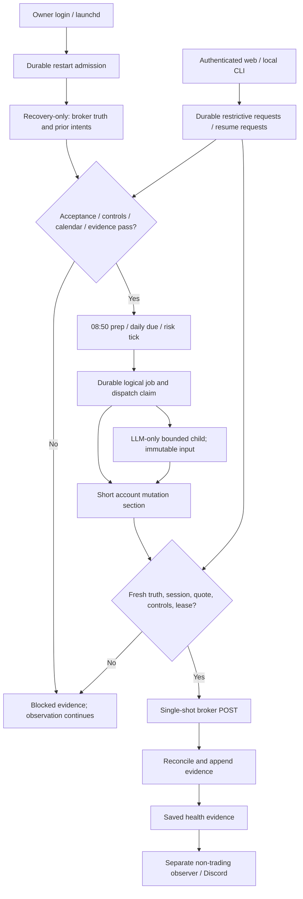

# Phase 15: Unattended Scheduling & Service Resilience - Research

**Researched:** 2026-10-04
**Domain:** Single-Mac supervision, durable scheduling and execution authority
**Confidence:** MEDIUM — external documentation confidence from the research seam; local behavior directly verified.

<user_constraints>
## User Constraints (from CONTEXT.md)

The following decisions and boundaries are copied verbatim. [VERIFIED: 15-CONTEXT.md]
## Implementation Decisions

### Execution time and monitoring cadence
- **D-01:** Schedule one daily LLM evaluation at 09:10 Asia/Seoul on positively confirmed eligible KRX days. Keep the existing daily input/signal uniqueness contract; one daily logical job is not a license to repeat provider calls.
- **D-02:** Start LLM-free held-position risk monitoring at 09:00 KST, protecting existing holdings before the daily evaluation. Serialize money-moving work with the existing account mutation exclusion; the watch must not monopolize authority and starve the 09:10 job.
- **D-03:** Use a 60-second risk-check cadence. Carry forward the existing session boundary: no new order submission at or after 15:20; reconciliation-only through the closing interval, and orderly watch termination at 15:30. Reconciliation failure remains recorded and frozen, not implicitly resolved at shutdown.
- **D-04:** Add an 08:50 KST preparation check using existing non-order readiness semantics. Recheck all applicable safety conditions at execution and immediately before submission. PRE_OPEN cannot authorize an order. No additional 09:05 preview job was selected.

### Missed execution and restart recovery
- **D-05:** A daily job that never started may catch up only before 09:20 KST on that same eligible date, after fresh safety checks. At or after 09:20, record a missed evaluation and surface it through existing alert semantics; do not backfill prior trading dates or move the job into an afternoon evaluation.
- **D-06:** After an unexpected service interruption, perform broker-truth reconciliation and recovery checks first, then automatically resume eligible remaining work if those checks pass. Uncertain orders retain their freezes and block affected work; no timeout or stale heartbeat independently grants mutation authority. Operator-requested pause/kill is not an unexpected interruption and must never be cleared by this automatic recovery path.
- **D-07:** For a partly completed daily evaluation, resume only never-dispatched ticker evaluations before 09:20, preserving saved inputs and progress. Do not repeat completed evaluations, blindly retry an uncertain LLM call, or replace the first committed canonical input. After the resume window, record unfinished work explicitly. Research/planning must distinguish dispatch deadlines from bounded completion/reconciliation of already-dispatched work; the window does not authorize abandoning order evidence.
- **D-08:** A failed or missed daily evaluation does not itself stop held-position protection. Continue risk monitoring when its own fresh portfolio/quote/order/lease checks pass. Shared safety faults continue to block mutation; this separation cannot bypass a global kill, unhealthy audit evidence, unresolved authority or other common gates.

### Pause, resume and global kill
- **D-09:** Normal pause stops daily evaluation and new BUY activity while retaining deterministic stop-loss/take-profit monitoring and submitted-order reconciliation. Enforce the BUY block even if an earlier evaluation or another invocation already produced a BUY signal.
- **D-10:** Global kill blocks every new order submission, including risk SELL, while leaving read-only observation, submitted-order reconciliation and alerts available. Do not automatically cancel outstanding orders or liquidate positions. Global stop authority must be checked by every affected money-moving path, not merely stop future scheduler launches.
- **D-11:** Provide pause/resume/kill controls in both CLI and the authenticated web application, including the owner's phone through the separately configured private access path. The web records narrowly authorized control requests; the execution service validates and applies them. The web must not instantiate trading credentials, directly place/cancel orders, call an LLM, write trading policy or clear evidence gates. Preserve authentication, authorization, CSRF, actor/time audit and observable requested-versus-applied state.
- **D-12:** Operator pause and kill persist across process restarts, login and trading-date changes until an explicit operator resume. Resume still requires fresh safety checks and all existing gates; it cannot clear a broker freeze or safety latch. No expiry, next-day auto-unpause or automatic kill reset was selected.

### Service operation and health
- **D-13:** Target the current development Mac as the single execution machine. Do not require a separate Mac or Linux server for this phase. Scheduled operation requires that this Mac be powered on and awake; do not claim uninterrupted service from a sleeping laptop.
- **D-14:** Start the service automatically after the owner logs into macOS, rather than before login or by daily manual start. Every launch first enters the durable recovery/safety path and retains any operator pause/kill. This decision describes the intended installed service; the discussion does not install it or start unattended orders.
- **D-15:** After an unexpected process exit, allow at most three automatic restart attempts within a ten-minute window. Stop the restart loop on repeated failure and persist a manual-attention state for health display/alerting. Preserve accounting across crashes so relaunch does not reset the limit. Each attempt retains job identity and requires recovery checks. Exact restart backoff, timeout handling and reset mechanics remain planning decisions within this limit.
- **D-16:** Show missed schedules, stalled workers, stale market data and notification failures in the web health view. Use the existing Discord problem-occurrence/worsening/recovery semantics and 30-minute reminders for unacknowledged CRITICAL episodes; do not add a routine daily 08:50 success notification. Preserve INFO web history, deduplication, acknowledgement semantics and delivery uncertainty. A total outage or sleep of this Mac cannot be detected and notified immediately by processes on the same stopped machine; the user was told this limitation.

### Carried-forward requirements and planning responsibilities

The owner answered every preference rather than delegating defaults. Choose the scheduler library, macOS service mechanism, module names, schemas, control-request transport, bounded timeouts/backoff and health thresholds during research/planning.

- KRX calendar evidence remains authoritative. Holidays are not inferred from weekdays; unknown calendar/session state fails closed. All times are KST. Preserve completed-bar cutoffs, current broker truth and pre-submit quote freshness. Research exceptional/delayed exchange sessions and apply documented session restrictions rather than overriding them with wall-clock schedules.
- Use durable logical job identity, account/target scope, first-input wins, checkpoints, process exclusion and ordered recovery together. A durable intent does not prove that an external POST occurred exactly once; ambiguous submissions remain UNKNOWN and are never blindly resubmitted. Existing manual CLI invocations must participate in exclusion and global stop enforcement.
- The separately bounded risk worker and daily evaluation need coordinated ownership without overlapping mutation. Restart begins recovery-only and cannot trust stale in-memory cash, holdings, lease heartbeat or locally projected proceeds. Persist terminal/partial/missed/blocked states honestly.
- Maintain independent non-trading health observation and alert delivery while the trading worker is paused, killed, crashed or restart-limited. Reuse Phase 14 evidence and alert ownership without requiring an open browser; do not create duplicate notifications or falsify successful delivery during an outage. Expected-worker health must account for the schedule, confirmed session, operator controls and login/service state.
- Ship an explicit dry-run/disabled setup path and enforce Phase 9 acceptance at the unattended mutation boundary. Default mock mode remains; no configuration, automatic restart or resume can enable real mode or bypass Phase 16.
- Use protected owner-local configuration, narrow capabilities and sanitized durable evidence. Web control scope is limited to the selected operational requests, not arbitrary jobs, file paths, settings changes or policy edits. Readiness and alert acknowledgement still grant no execution authority.
- Research current official macOS service and scheduler contracts. Define documented start/stop/status, logout/sleep/wake behavior, installation/removal and evidence-preserving recovery. Wake/relogin must re-evaluate deadlines and elapsed health gaps instead of replaying missed jobs. No unattended-before-login guarantee or external independent outage monitor was selected.


### Deferred Ideas (OUT OF SCOPE)
None introduced by the owner; discussion stayed within Phase 15. Existing roadmap boundaries retain the Phase 16 real-money pilot and explicit promotion approval. Actual Tailscale deployment and phone/Mac external device acceptance remain the previously recorded follow-up; selecting web controls does not claim that private access is configured. No separate execution server, before-login daemon or independent external outage monitor was selected.

</user_constraints>

<phase_requirements>
## Phase Requirements

| ID | Description | Research Support |
|---|---|---|
| FUT-04 | Operator can schedule unattended cycles only after manual-operation evidence is sufficient. | Evidence-linked acceptance receipt and disabled-by-default activation; offline verification remains available. |
| AUTO-01 | Scheduled daily and intraday workers use KRX calendar/session rules, leader locking, durable checkpoints, and idempotent invocation identities so one logical job cannot submit twice. | Date-specific session evidence, separate service leader and bounded account leases, immutable job/evaluation/dispatch identities, recovery-first reconciliation. |
| AUTO-02 | Operator can pause, resume, inspect health, recover after restart, and activate a global kill switch without losing audit or reconciliation evidence. | Durable request/application journal, shared final submission guard, independent observer, persistent restart budget and explicit resume. |
</phase_requirements>

Requirement descriptions above are verbatim. [VERIFIED: .planning/REQUIREMENTS.md]

## Project Constraints (from AGENTS.md)

- Python and Korean-market sources are required; strict three-field JSON signals fail safe and BUY requires confidence >= 0.8. [VERIFIED: AGENTS.md]
- Mock-first operation and deliberate manual real-money promotion remain mandatory. [VERIFIED: AGENTS.md]
- Use typed settings, protected secrets, SQLite audit evidence and existing code patterns. The published stack discusses python-kis, but the actual project has custom KIS adapters; this phase should integrate shipped adapters rather than replace the order path. [VERIFIED: AGENTS.md; pyproject.toml; trading_bot/kis_order.py]
- Repository changes must occur through GSD. This artifact belongs to the already invoked Phase 15 planning workflow; no implementation, installation, activation or commit was performed. [VERIFIED: AGENTS.md; parent task]
- No established convention/architecture overrides were found in AGENTS.md; .claude/CLAUDE.md carries equivalent safety constraints. Project source-command skills are routing wrappers; no additional research rules were applicable. [VERIFIED: AGENTS.md; .claude/CLAUDE.md; .agents/skills/*/SKILL.md]

## Summary

Use launchd for owner-login supervision and Python stdlib scheduling primitives for wake hints, with SQLite holding the actual job, deadline, control and recovery contracts. Keep the trading leader, account mutation authority and non-trading incident observer distinct. Existing calendar, broker, lease and evidence components are reusable, but simply scheduling the existing commands would preserve unsafe retry/recovery gaps and would let the day-long risk watch starve daily evaluation. [VERIFIED: trading_bot/cli.py; trading_bot/mutation_lease.py; trading_bot/intraday.py]

**Primary recommendation:** Implement the contracts below before enabling any unattended mutation; default to an offline dry-run and separately gate authenticated KIS mock execution. These are implementation proposals within the documented discretion, not additional owner decisions. [VERIFIED: 15-CONTEXT.md]

## Architectural Responsibility Map

| Capability | Primary tier | Secondary tier | Basis |
|---|---|---|---|
| Login/start/restart process supervision | macOS LaunchAgent | Minimal durable admission entrypoint | Owner-login boundary, not pre-login daemon. [CITED: https://developer.apple.com/library/archive/documentation/MacOSX/Conceptual/BPSystemStartup/Chapters/CreatingLaunchdJobs.html] |
| Schedule/calendar/deadline dispatch | Execution service | Scheduler-owned SQLite journal | Timing does not grant mutation authority. [VERIFIED: 15-CONTEXT.md] |
| Fresh broker truth and POST | Existing backend adapters | Account-scoped lease | Paired truth/lease/revalidation gates already exist. [VERIFIED: trading_bot/kis_broker.py:139] |
| Control requests and status | Authenticated web/CLI | Narrow operational store | Web records requests; execution applies them. [VERIFIED: 15-CONTEXT.md D-11] |
| Incident detection/delivery | Independent observer | Saved-evidence readers | Observer already runs independently of browsers. [VERIFIED: trading_bot/alert_observer.py] |

## Standard Stack

| Component | Use | Verified version/status |
|---|---|---|
| Python stdlib sched, time, zoneinfo, subprocess, fcntl, sqlite3 | Timer hints, bounded child supervision, local exclusion and durable state | Local Python 3.14.3 / SQLite 3.51.3; project supports >=3.10. [VERIFIED: runtime probes; pyproject.toml] |
| Existing Typer / Pydantic / pydantic-settings | CLI and strict dedicated service/control settings | Pins 0.26.8 / 2.13.4 / 2.11.0; installed versions match. [VERIFIED: pyproject.toml; importlib.metadata] |
| Existing Flask / Flask-WTF / waitress | Authenticated control-request endpoints and health views | Pins 3.1.3 / 1.3.0 / 3.0.2; installed versions match. [VERIFIED: pyproject.toml; importlib.metadata] |
| Existing pytest | Offline deterministic validation | 8.4.2, configuration in pyproject.toml. [VERIFIED: pyproject.toml; runtime probe] |

Keep existing dependency pins; no new package installation is recommended. PyPI checks found newer Typer 0.27.2, Pydantic 2.13.5 and pydantic-settings 2.15.0, but an upgrade is outside this integration's need. Pinned publish dates respectively: 2026-06-26, 2026-05-06, 2025-09-24. [VERIFIED: pip index versions; official PyPI JSON]

APScheduler 3.x offers coalescing, misfire_grace_time and max_instances, but its FAQ warns against multiple processes sharing one persistent job store. It would still require the domain journal, manual-path exclusion and strict deadline logic. Use stdlib timer hints for these fixed schedules instead; do not mix 3.x and master APIs. [CITED: https://apscheduler.readthedocs.io/en/3.x/userguide.html; https://apscheduler.readthedocs.io/en/3.x/faq.html]

## Package Legitimacy Audit

Not applicable: no new external packages or dependency upgrades are proposed. Existing package pins are deployment facts, not new registry-legitimacy approvals. If implementation adds a package, perform the required legitimacy and correct-ecosystem registry gates first. [VERIFIED: pyproject.toml; research scope]

## Architecture Patterns

Proposed flow, grounded in D-01–D-16 and existing authority boundaries. [VERIFIED: 15-CONTEXT.md; trading_bot/mutation_lease.py]



### Named integration contracts

| Contract / candidate files | Required implementation behavior | Verified gap or reusable symbol |
|---|---|---|
| SessionEvidence / market_cycle.py, data_source.py | Date-scoped source identity/hash, reviewed session open/close, eligibility, observed/effective date and explicit UNKNOWN. Feed the same session evidence into scheduling, preflight, intraday classification and final POST. | MarketCyclePolicy.classify and intraday.session_phase_at hardcode normal hours; ObservedKRXCalendar caches invocation-local UNKNOWN and has an optional current-day KIS witness. [VERIFIED: those symbols] |
| ServiceJournal / new service_store.py, service_models.py | Separate versioned local owner store for service generations, job IDs, tick checkpoints, restart attempts, controls applied and acceptance references; append events with bounded diagnostics. Job key includes account/target/date/kind; no per-launch UUID as logical daily identity. | Existing audit/portfolio stores own trading facts; web operational DB cannot amend them. [VERIFIED: portfolio_store.py; web_config.py] |
| FairAccountWork / cli.py, intraday.py, mutation_lease.py | Service leader flock is separate from account mutation flock. Acquire mutation lease for one bounded risk pass or one current-signal execution section, reconcile and release. Never hold account authority while sleeping or awaiting LLM. Manual paths use identical guards and cannot steal locks. | _default_intraday_command_runner acquires one lease before run_intraday_watch and releases after the full watch; run_cycle normally holds it across the full universe. [VERIFIED: cli.py:2346; cli.py:1568] |
| DailyDispatch / portfolio_store.py, llm_provider.py, cli.py | Persist ordered universe and first canonical input; atomically distinguish INPUT_COMMITTED, DISPATCHED, finalized, dispatched-unknown and expired-never-dispatched. Dispatch stored input, not reconstructed current context. Recovery resumes only never-dispatched units before 09:20. | start_daily_evaluation preserves input but uniqueness is date/ticker; _load_or_generate_daily_signal uses newly built context. recover_started_evaluations finalizes all STARTED as unavailable; run_cycle calls it before acquiring lease. [VERIFIED: portfolio_store.py:576; portfolio_store.py:726; cli.py:268] |
| FinalSubmissionAuthority / kis_broker.py, exit_manager.py, mock_broker.py, cli.py | Shared final guard checks global kill, pending restrictive requests, pause BUY block, current session, lease, freeze and freshness. Attach it to every order-capable composition, including manual run/intraday and designated mock paths. Controls never cancel or liquidate. | KISBroker.place_order has final truth/lease/quote gates and SUBMISSION_ATTEMPTED before POST, but no global operational controls. [VERIFIED: kis_broker.py:139; cli.py] |
| OperationalRequests / new control_store.py, web_app.py, web_store.py | Allowlisted PAUSE/RESUME/KILL, fixed registered scope, request ID, actor/time and expected control revision; execution writes separate applied/rejected evidence. Restrictive pending requests already deny affected submissions; resume can grant nothing while pending. | create_app supplies authentication, scope authorization, CSRF and action audit; currently no execution controls. [VERIFIED: web_app.py; web_auth.py] |
| ServiceHealth / web_evidence.py, alert_detector.py, alert_observer.py | Saved schedule expectations and heartbeats cover prep, daily, risk, leader/restart-limited state, stale inputs and notification failures. Independent observer reads these without constructing trading settings. | _workers derives intraday expectations from saved lifecycle, not scheduled jobs; detector needs positive source IDs/times and does not detect absent schedule records. [VERIFIED: web_evidence.py:415; alert_detector.py:116] |

### Daily recovery and deadline contract

Use the existing daily uniqueness key rather than introducing a parallel signal cache. Bind its account/target to the job; reject conflicting scope instead of silently reusing another account's input. Separate never-dispatched from uncertain dispatched state before changing the legacy recovery routine, and perform recovery only after exclusive ownership. Never recreate canonical inputs on resume. [VERIFIED: portfolio_store.py:576; cli.py:1657; proposed integration]

A provider call currently has three possible retry layers: daily orchestration, adapter tenacity and SDK defaults. Both installed SDK constructors default to two retries. Use single-shot dispatch adapters, SDK max_retries=0 and bounded timeouts; classify uncertain outcomes without automatic re-dispatch. Existing Phase 11 allows bounded logical retries, but Phase 15's newer D-07 forbids blindly retrying uncertain calls; any permitted pre-dispatch failure must have positive no-dispatch proof. [VERIFIED: cli.py:268; llm_provider.py:176; installed SDK signatures; 15-CONTEXT.md D-07]

Check deadline immediately before each new provider dispatch using aware KST: 09:10 <= now < 09:20 on the same positively eligible date. A claim at 09:19:59 does not authorize a fresh attempt after 09:20. Already dispatched work may finish within its bounded timeout and append signal/order/reconciliation evidence; it must still pass current controls/session/freshness before submitting. Mark other units unfinished/missed. Resume does not rerun finalized units or automatically execute a completed unit again. [VERIFIED: 15-CONTEXT.md D-05–D-07; proposed contract]

Keep the provider child free of broker/lease capability and its slow call outside account authority. Risk cadence is a target, not an exact real-time guarantee: bounded broker work and LLM isolation prevent systematic starvation, while contention/overruns produce explicit skipped/stalled evidence. No catch-up burst of overdue risk ticks. [VERIFIED: 15-CONTEXT.md D-02/D-03; proposed contract]

### Authoritative session exceptions

KRX publishes normal stock hours 09:00–15:30 and exchange-designated holidays; a weekday test is insufficient. A KIND notice for 2023-11-16 explicitly shifted regular trading to 10:00–16:30. Current KIS hours guidance also recognizes first-year-day and exam-day changes. These establish exceptions, not an authoritative schedule for a future date. [CITED: https://global.krx.co.kr/contents/GLB/06/0602/0602020204/GLB0602020204T1.jsp; https://kind.krx.co.kr/external/2023/11/02/000075/20231101001384/70780.htm; https://securities.koreainvestment.com/main/customer/guide/_static/TF04ad010000.jsp?tab=2]

Require reviewed exchange notice/session evidence for supported dates and refresh uncertain current-day evidence; do not use a long-lived calendar instance that caches UNKNOWN forever. A boolean trading-day witness alone cannot establish exceptional session times. Until such evidence is available, fail closed. On a positively confirmed 10:00 opening, the locked before-09:20 daily deadline yields a blocked/missed daily evaluation; do not move it to 10:10. Risk may become eligible after actual opening while retaining the owner's absolute 15:20 POST cutoff and 15:30 termination; do not extend to 16:30 without a new decision. [VERIFIED: data_source.py:68; market_cycle.py; 15-CONTEXT.md; proposed contract]

08:50 preparation must use read-only readiness semantics: existing evaluate_preflight intentionally blocks PRE_OPEN for execution. Preserve that BLOCK instead of bypassing it; report preparation availability separately from execution permission. [VERIFIED: preflight.py:150; cli.py:1425]

### Controls and scope-wide stop

Persist RUNNING/PAUSED/KILLED independently from trading date, process generation and unattended activation. Require explicit resume with fresh checks; missing/corrupt control evidence blocks mutation. Global kill applies to all registered money-moving paths; a narrower account selector cannot leave another invocation exempt. Pause stops daily evaluation and every new BUY, including execution of an already saved BUY; deterministic risk SELL and reconciliation remain eligible under their own gates. [VERIFIED: 15-CONTEXT.md D-09–D-12; proposed contract]

Use a dedicated narrow request journal and capability-limited readers; the web cannot write the scheduler's authoritative applied state or production audit stores. Preserve requested-versus-applied status. Reject stale resume revisions, make kill dominant over queued resume, and read pending restrictive requests at the final boundary even when the service is crashed. CLI submissions use the same request contract; unavailable service is not implicit application. [VERIFIED: web_config.py; web_app.py; 15-CONTEXT.md; proposed contract]

Define a serialized local stop/submission-admission boundary and test its race: once a restrictive request is durably accepted, no later submission admission may begin. Bound any lock wait and expose an in-flight submission honestly. A kill cannot recall a POST already transmitted; submission ambiguity still requires reconciliation. Do not advertise instantaneous broker cancellation or rely solely on a polling heartbeat/control flag. [VERIFIED: kis_broker.py:139; 15-CONTEXT.md; proposed contract]

### LaunchAgent and restart admission

Apple's archived official guide states per-user agents load at login and receive SIGTERM at logout. The current macOS 26.5.2 local launchd.plist manual confirms KeepAlive/SuccessfulExit conditions, default ten-second throttling, and calendar-trigger wake coalescing. ThrottleInterval is minimum spawn spacing, not a three-attempt sliding budget. Use the local manual as the version-specific primary contract; the web guide is historical. [CITED: https://developer.apple.com/library/archive/documentation/MacOSX/Conceptual/BPSystemStartup/Chapters/CreatingLaunchdJobs.html; VERIFIED: /usr/share/man/man5/launchd.plist.5; /usr/share/man/man1/launchctl.1]

Provide a minimal supervision entrypoint with RunAtLoad and conditional KeepAlive SuccessfulExit=false, absolute interpreter/argv/working/config/log paths, protected files and bounded shutdown. Before any worker recovery or collaborator construction, durably reserve an admitted automatic restart attempt in the preceding 600 seconds. Allow at most three after an unexpected exit; on exhaustion persist MANUAL_ATTENTION and exit cleanly so conditional KeepAlive stops. Preserve failed admissions and attempts across crashes; clock reversal/unknown elapsed time cannot replenish authority. [VERIFIED: 15-CONTEXT.md D-14/D-15; local launchd manual; proposed contract]

Distinguish OS launcher invocations from admitted execution-worker restarts: launchd may start a minimal entrypoint to discover exhaustion, but that invocation must never run another recovery/trading worker. If implementing a persistent supervisor with child workers, enforce the same journal at both supervisor-entry and child-launch boundaries. Do not claim native launchd itself stops exactly after three launches. Reset the manual-attention latch only explicitly after the window and fresh recovery checks; never delete restart history or clear operator kill. [VERIFIED: local launchd manual; 15-CONTEXT.md; proposed contract]

Use launchctl bootstrap gui/<uid>, bootout, print and explicit kickstart for documented installation/removal/status; avoid kickstart -k as a normal resume path because it kills a running process. Render/validate plists and disabled dry-run setup first; actual bootstrap/activation is a separate operator step. Supervise bot-alerts separately so trading restart exhaustion cannot stop observation. Logout, sleep and full-Mac outage suspend local availability; wake/relogin recomputes date/deadlines and health gaps, never replays expired jobs. [VERIFIED: local launchctl manual; 15-CONTEXT.md; proposed contract]

### Phase 9 activation evidence and dry-run composition

Read-only inspection found nine local campaigns: one non-credit PROOF_ORDER; seven SOAK campaigns permanently FAILED with D09_BROKER_TRUTH_DISAGREEMENT; one ACTIVE SOAK campaign with 17 credited dates of target 20. Thirty-eight CREDITED rows across campaigns cannot be combined into acceptance. Freeze history includes 000660. No 09-08-SUMMARY.md, 09-UAT.md or 09-VERIFICATION.md exists, and soak schema has no explicit operator-approval record. These observations are not a fresh authenticated broker proof. [VERIFIED: read-only data/soak.db queries; phase artifact existence checks; 09-08-PLAN.md]

Introduce an explicit local acceptance receipt referencing both 09-08 human checkpoint approvals, the immutable campaign/profile and primary/soak/controller evidence identities, target/budget/safety verdicts and validated drill/source links. A flag, plan file, aggregate count or advisory readiness PASS cannot substitute. Gate unattended mutation before collaborators and again at final authorization; stale/changed evidence or unresolved applicable freezes remains blocked. Synthetic fixture receipts test rejection/acceptance logic but never authorize production. [VERIFIED: 09-08-PLAN.md; 15-CONTEXT.md; proposed contract]

Current bot run without --execute still builds KIS/data collaborators and calls the daily LLM. It is order-disabled, not offline or necessarily free. In ordinary MOCK mode, _build_broker returns in-memory MockBroker; authenticated KIS mock POST exists in _build_soak_runtime using KISBroker. Do not label local simulated fills as broker-facing mock acceptance. [VERIFIED: cli.py:1176; cli.py:1568; cli.py:960]

Deliver service dry-run with injected/frozen calendar/portfolio/signals, a dedicated test journal and zero KIS, LLM, pykrx, Discord, subprocess-provider, policy-write or service-install capability. A disabled setup cannot call providers. Separately build a reviewed authenticated KIS-mock composition reusing adapters and all existing safety gates; do not schedule soak accounting or inherit real-mode confirmation. [VERIFIED: 15-CONTEXT.md; tests/capability_probe.py; proposed contract]

## Don't Hand-Roll

| Problem | Use instead | Basis |
|---|---|---|
| Broker protocol, quote checks and reconciliation | Existing KisOrderAdapter, KISBroker, portfolio normalization | Existing single-shot POST and evidence boundaries. [VERIFIED: kis_order.py; kis_broker.py] |
| Local process lock and ownership proof | Existing MutationLease plus separate service-leader flock | Durable predecessor recovery already exists. [VERIFIED: mutation_lease.py] |
| Passwords, sessions and CSRF | Existing WebAuth and Flask-WTF | Shipped session/authorization/action audits. [VERIFIED: web_auth.py; web_app.py] |
| Incident deduplication and reminders | Existing AlertObserver/AlertStore | Producer ownership, UNKNOWN delivery and reminders already persisted. [VERIFIED: alert_observer.py; alert_store.py] |
| Timer queue and timezone conversion | stdlib sched/zoneinfo; explicit domain deadline reducer | sched does not drop overdue events; domain must discard stale work. [CITED: https://docs.python.org/3.12/library/sched.html; https://docs.python.org/3.12/library/zoneinfo.html] |

## Runtime State Inventory

| Category | Findings and planning action |
|---|---|
| Stored data | Existing audit daily_evaluations only STARTED/FINALIZED and date/ticker uniqueness; version migration/backfill must conservatively distinguish any PROVIDER_ATTEMPT as dispatched. Preserve inputs, events, freezes and old web readers. New service/control schemas need explicit ownership. [VERIFIED: audit_models.py; portfolio_store.py; runtime table inspection] |
| Live service configuration | No live external configuration inspected or changed. Target deployment configuration remains an installation-time audit, not evidence that no external setup exists. [VERIFIED: research action scope] |
| OS-registered state | launchctl is available; owner LaunchAgent registrations were not enumerated. Plan collision/ownership checks before installing fixed labels; do not overwrite unrelated jobs. [VERIFIED: runtime probe; research scope] |
| Secrets/env vars | Existing trading, web and observer settings have distinct capability boundaries; secret values were not read. New service config must reference protected owner-local paths and keep credentials out of plists/argv/evidence. [VERIFIED: config.py; web_config.py; alert_config.py; proposed contract] |
| Build artifacts | .venv and .python-userbase exist; local Python is 3.14.3. Installed CLI entrypoints need refreshed editable/package installation when new commands are implemented; use explicit interpreter paths. [VERIFIED: availability probes; pyproject.toml; proposed contract] |

## Common Pitfalls

- Timer firing or a positive weekday is mistaken for order permission; require current authoritative session and final gates. [VERIFIED: market_cycle.py; 15-CONTEXT.md]
- The day-long watch or slow provider holds the account lease; split bounded sections and observe overruns. [VERIFIED: cli.py:2346]
- Recovery finalizes never-dispatched inputs or retries uncertain provider calls; migrate durable dispatch distinctions and retain first-input wins. [VERIFIED: portfolio_store.py:726; cli.py:268]
- Releasing a lease, advancing the date, acknowledging an alert or resuming the service clears a freeze; none proves same-subject terminal broker truth. [VERIFIED: 09-08-PLAN.md; STATE.md; alert_detector.py]
- Controls only prevent future job launches; attach shared guards to every final submission path and stale saved BUY. [VERIFIED: 15-CONTEXT.md D-09/D-10]
- Web/observer/worker journals are treated as one atomic database; preserve per-source identities and fail closed on contradictory/unknown links. [VERIFIED: web_evidence.py; 14-CONTEXT.md]
- Same-Mac outage notification is guaranteed; observation can report elapsed gaps after recovery, not notify while every process is stopped. [VERIFIED: 15-CONTEXT.md D-16]

## Code Examples

Proposed pure deadline predicate, using the existing timezone/session contract; this is illustrative, not an existing symbol. [VERIFIED: market_cycle.py; 15-CONTEXT.md D-05/D-07]
```python
def may_dispatch_daily(now, eligible_date, session, control, never_dispatched):
    kst = now.astimezone(KST)
    return (
        kst.date() == eligible_date
        and time(9, 10) <= kst.time() < time(9, 20)
        and session.executable
        and control.daily_allowed
        and never_dispatched
    )
```

Use short BEGIN IMMEDIATE transactions to reserve jobs/dispatch/control revisions, then commit before network work; SQLite permits one writer and may return BUSY. Polling needs bounded busy handling and must never interpret DB failure as authorization. [CITED: https://sqlite.org/lang_transaction.html]
Use monotonic deltas for in-process waits, aware UTC/KST timestamps for persisted deadlines; monotonic has an unspecified reference point and is not a durable timestamp. [CITED: https://docs.python.org/3/library/time.html#time.monotonic]

## State of the Art

launchctl bootstrap/bootout replace deprecated load/unload operational guidance; current local manuals support these commands. KeepAlive is supervision, not application recovery or bounded restart accounting. [VERIFIED: /usr/share/man/man1/launchctl.1; /usr/share/man/man5/launchd.plist.5]
Current ASVS 5.0 numbering differs from the old template's 4.x categories; use versioned category names below. [CITED: https://owasp.org/projects/asvs; https://github.com/OWASP/ASVS/blob/master/5.0/docs_en/OWASP_Application_Security_Verification_Standard_5.0.0_en.json]

## Environment Availability

| Dependency | Available | Fallback / limitation |
|---|---|---|
| macOS launchctl/plist manual | Yes, macOS 26.5.2 | Render/validate only during offline tests; installation not performed. [VERIFIED: command probes] |
| Python / sqlite / pytest / web extra | Yes, versions above | Explicit interpreter and PYTHONUSERBASE needed for this workspace. [VERIFIED: probes; pyproject.toml] |
| uv / ctx7 / Context7 MCP | Not found in session | Python/pip for existing runtime; official web docs used after provider fallback. [VERIFIED: tool/PATH discovery] |
| Phase 9 acceptance | Missing | No unattended-mutation fallback; implement/test disabled mode first. [VERIFIED: acceptance audit] |
| Owner-private phone access | Not verified | Local authenticated web acceptance first; Tailscale/device configuration remains separate follow-up. [VERIFIED: STATE.md; 15-CONTEXT.md] |

## Validation Architecture

### Test Framework
| Property | Value |
|---|---|
| Framework / config | pytest 8.4.2 / pyproject.toml. [VERIFIED: runtime; config] |
| Quick existing regression | PYTHONUSERBASE="$PWD/.python-userbase" python3 -m pytest -q tests/test_market_cycle.py tests/test_mutation_lease.py tests/test_portfolio_store.py tests/test_phase11_cli.py tests/test_intraday.py tests/test_web_capabilities.py tests/test_alert_observer.py |
| Full suite | PYTHONUSERBASE="$PWD/.python-userbase" python3 -m pytest -q |
| Observed baseline | Quick existing regression: 103 passed in 21.90 seconds; full suite not run by researcher. [VERIFIED: pytest output] |

### Phase Requirements → Test Map
Proposed new tests below are Wave 0 gaps; existing fixtures provide injectable clocks, fake providers/brokers and temporary SQLite stores. Keep focused commands below 30 seconds and never call production collaborators. [VERIFIED: tests/conftest.py; tests/test_mutation_lease.py; proposed validation]
| Req | Test file / command suffix (python3 -m pytest -q) | Required checks |
|---|---|---|
| FUT-04 | tests/test_service_activation.py | Missing/stale/synthetic acceptance blocked; both explicit approvals and exact evidence identity; real mode always rejected; unresolved freezes survive. |
| AUTO-01 | tests/test_service_schedule.py | 08:50 read-only; 09:00 risk; 09:10 daily; strict 09:20; holidays/UNKNOWN/delayed sessions; wake/date changes; no prior-day backfill. |
| AUTO-01 | tests/test_service_recovery.py | Crash after input commit/before dispatch, after dispatch/before response, after response/before signal commit, before/after submission event/POST; no repeat dispatched provider or intent. |
| AUTO-01 | tests/test_service_authority.py | Two-process leader/account exclusion; daily progresses while risk scheduled; slow LLM does not retain lease; manual contention and stop guards. |
| AUTO-02 | tests/test_service_controls.py | Pending/applied pause/kill, pre-POST race, stale resume, all money-moving paths, restart/date persistence; no cancel/liquidation/clear-freeze. |
| AUTO-02 | tests/test_service_health.py | Absent schedules, stale quotes, stalled worker, restart limit, notification UNKNOWN/failure, expected/not-expected/UNKNOWN distinctions. |
| AUTO-02 | tests/test_service_launchd.py | Absolute/protected paths, login domain, graceful stop, at most 3 admitted restarts/600s, no auto latch reset, rejected bootstrap does not start worker. |
| AUTO-02 | tests/test_web_control_routes.py | Authentication/authorization/CSRF/replay/resource bounds, actor/action audit, requested/applied mobile UI, forbidden collaborator capability probes. |
| All | tests/test_service_dry_run.py | Zero provider/KIS/Discord/service-install calls and unchanged production files, while deterministic temp-journal recovery is exercised. |

### Sampling Rate
- Per task: focused new tests plus closest existing regression module; each uses PYTHONUSERBASE="$PWD/.python-userbase". [VERIFIED: project config; proposed validation]
- Per wave: relevant existing regression group above; phase gate: full suite green plus browser control acceptance and disabled LaunchAgent lifecycle review. [VERIFIED: project config; proposed validation]
- Authenticated Phase 9 acceptance, actual login/logout/wake behavior and outside-home phone access are explicit human checks; deterministic tests cannot supply them. Planning/dry-run tests can finish while activation stays blocked. [VERIFIED: 09-08-PLAN.md; 15-CONTEXT.md]

### Wave 0 Gaps
- All proposed test files in the map; fake clock/session exceptions, dispatch crash barriers and spawn-safe process fixtures. [VERIFIED: repository test inventory; proposed validation]
- Update tests/test_portfolio_store.py recovery expectation and tests/test_phase11_cli.py reuse paths with new conservative migration; preserve existing ambiguity/lease/quote tests. [VERIFIED: existing tests; proposed validation]
- No test-framework installation needed. [VERIFIED: successful baseline]

## Security Domain

Security enforcement and Nyquist validation are enabled in config. [VERIFIED: .planning/config.json]
| Applicable ASVS 5.0 category | Control |
|---|---|
| V6 Authentication / V7 Session Management | Existing dedicated operator identity, server sessions and absolute expiry; control routes use existing guards. |
| V8 Authorization | Fixed scope and allowlisted actions; service is final authority; pending resume cannot grant privilege. |
| V2 Validation and Business Logic | Strict request schema, revisions/deadlines/identity, bounded errors, fail-closed evidence. |
| V3 Web Frontend Security / V4 API and Web Service | Existing CSRF, origin/host/proxy boundaries and response protections. |
| V11 Cryptography / V14 Data Protection / V16 Security Logging | Existing password/session primitives, owner-local secrets and sanitized attributable request/application logs. |

Categories verified against official ASVS 5.0 source; proposed controls reuse current Flask/Pydantic architecture rather than asserting regulatory obligations. [CITED: https://github.com/OWASP/ASVS/blob/master/5.0/docs_en/OWASP_Application_Security_Verification_Standard_5.0.0_en.json; VERIFIED: web_app.py; web_auth.py; web_config.py]
Primary threats: forged/resumed control (Spoofing/Elevation), overwritten journal or replayed dispatch (Tampering), missing actor/evidence links (Repudiation), secret-bearing plist/error output (Information Disclosure), stalled leader/restart storms (Denial of Service). Mitigations are the named contracts; no custom authentication/crypto or web trading collaborator. [VERIFIED: existing boundaries; proposed threat analysis]

## Assumptions Log

No training-only factual claims are promoted to decisions. Proposed contracts are explicitly labeled recommendations within the owner's discretion. Unknown production approvals, future-date session notices and deployed phone/service configuration remain unknown. [VERIFIED: research scope and findings]

## Open Questions

- **Date-specific session evidence:** no authoritative future-date exception feed was verified. Plan a reviewed source/override contract and UNKNOWN behavior before activation; do not extrapolate historical exam notices. [VERIFIED: official sources consulted; proposed action]
- **09-08 proof transport:** no machine-readable human acceptance receipt exists today. Implement a narrow explicit receipt linked to source evidence and retain the real operator checkpoint; it is an activation blocker, not a planning blocker. [VERIFIED: schema/artifact checks]
- **Exact supervision accounting:** distinguish minimal rejected launcher entries from admitted worker restart attempts, and make both observable. Native launchd does not implement the selected sliding limit. [VERIFIED: current local manual; proposed action]

## Sources

Primary authoritative sources consulted: Apple archived launchd guide and current local launchd.plist/launchctl manuals; Python sched/time/zoneinfo and SQLite transaction docs; official APScheduler 3.x guide/FAQ; KRX normal-hours page and KIND dated notice; KIS customer-hours page; official pinned SDK README/source and installed signatures; OWASP ASVS 5.0. URLs are attached to the corresponding claims. [VERIFIED: research fetch/probe results]

Local sources: 15-CONTEXT.md, REQUIREMENTS/ROADMAP/STATE/config, 09-08-PLAN.md, Phase 11–14 contracts, operator runbook, named production modules and existing test files; production journals were opened read-only for bounded schema/count inspection only. [VERIFIED: research reads]

## Metadata

**Confidence:** local implementation facts HIGH (direct reads/probes); external documentation MEDIUM (research seam classify-confidence --provider websearch --verified returned MEDIUM); integration recommendations MEDIUM pending implementation tests.
**Provider fallback:** research-plan selected Context7 for library questions; no Context7 MCP or ctx7 CLI was available, so official documentation was retrieved through web tools. Five digests cached with seam confidence MEDIUM.
**Valid until:** recheck macOS deployment and date-specific exchange notices at installation/activation; stable code findings must be rechecked if implementation changes.
**Changes made:** only this research artifact; no production code, configuration, service, credentials, paid calls, orders or commits.

